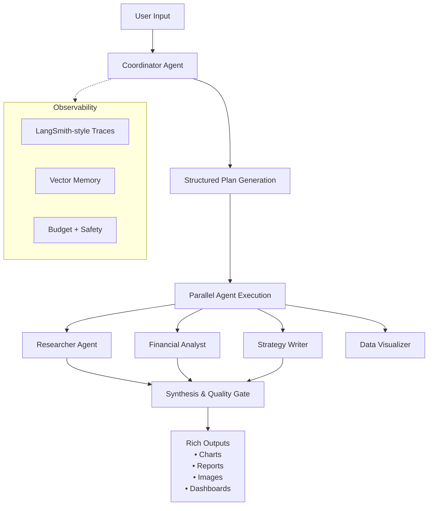

# TeamForge

A production-grade demonstration of a **Hyperagent / Multi-Agent Orchestration Platform** inspired by Airtable's vision for AI agents that can tackle complex, multi-step goals.

Built with Next.js 15, TypeScript, Tailwind, Zustand, and simulated Mastra-like agent primitives.

## Core Capabilities Demonstrated

- **Coordinator Agent**: Dynamically generates structured execution plans using JSON schemas
- **Specialized Agent Fleet**: Researcher, Financial Analyst, Strategist, Visualizer with persistent configs
- **Parallel Execution**: Agents run concurrently with dependency graphs
- **Tool Integration**: Web search, code execution sandbox simulation, image generation, data analysis
- **Streaming UX**: Real-time thoughts, tool calls, and progress updates
- **Rich Deliverables**: Embedded charts (Recharts ready), generated images, tables, structured reports
- **Observability**: Complete trace of every agent action with timestamps and costs
- **Memory & State**: Persistent runs, agent memory simulation

## Tech Stack

- **Framework**: Next.js 15 (App Router) + React 19
- **Styling**: Tailwind CSS + shadcn/ui inspired design system
- **State**: Zustand for global agent & run management
- **Schemas**: Zod for all tool definitions and structured outputs
- **Visualization**: Recharts (ready for integration), Lucide icons
- **AI Simulation**: Mock streaming with realistic timing and tool calls (ready for Vercel AI SDK + Mastra or LangGraph.js)

## Getting Started

1. Install dependencies:
```bash
npm install
# If you see peer dependency warnings, use:
# npm install --legacy-peer-deps
```

2. Run the development server:
```bash
npm run dev
```

3. Open [http://localhost:3000](http://localhost:3000)

## Project Structure

```
/app
  layout.tsx          # Root layout with dark theme
  page.tsx            # Main command center UI
/lib
  types.ts            # Core TypeScript interfaces
  agents.ts           # Agent definitions, mock tools, plan generator
  store.ts            # Zustand global state + simulation engine
/components
  AgentCard.tsx       # Fleet cards
  RunViewer.tsx       # Live execution trace and rich output renderer
```

## Extending This Demo

### Adding Real AI

Replace the simulation functions in `lib/agents.ts` and `lib/store.ts` with:

```ts
import { generateText, streamText } from 'ai';
import { openai } from '@ai-sdk/openai';
// or mastra, langgraph, etc.
```

### Adding Mastra

1. Install `mastra` and `@mastra/core`
2. Create workflows with `createWorkflow()`
3. Define tools with Zod schemas
4. Add memory stores (Upstash Vector, Pinecone)
5. Integrate the Coordinator as the entrypoint workflow

### Real Tools

- **E2B** or **Fireworks** for sandboxed code execution
- **Tavily** or **Serper** for web search
- **Replicate** / **Fal.ai** for Flux image generation
- **LangSmith** / **Helicone** for observability

### Production Features to Add Next

- Authentication & multi-tenancy
- Real vector memory (RAG over past runs)
- Human-in-the-loop approval gates
- Cost tracking & budget guardrails
- Evaluation framework (LLM-as-judge)
- Export to PDF/Notion/Slack
- Agent definition UI with Monaco editor for prompts
- Live trace visualization (like LangSmith)

## Architecture Diagram



**This is fully interactive.** Try launching missions with the example prompts. Watch the Coordinator break down the goal, deploy agents in parallel, simulate tool calls, and synthesize beautiful final deliverables.

Built as a demonstration of modern agentic systems in 2026.
```

## Future Roadmap

- Full Mastra integration with real LLM calls
- Persistent database (Supabase/Postgres + vector search)
- Agent configuration UI with live prompt testing
- Advanced visualization components
- Multi-modal output support
- Team collaboration features

Made with ❤️ for the AI engineering community.
